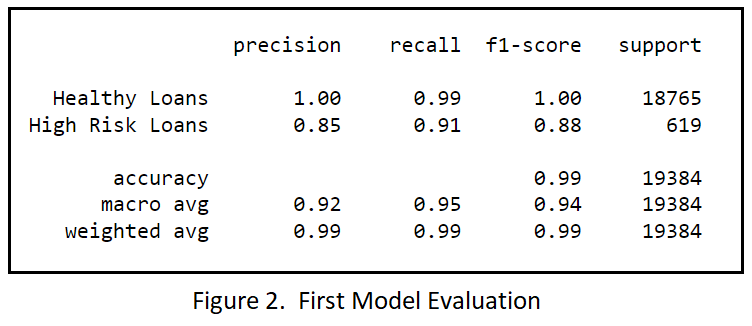
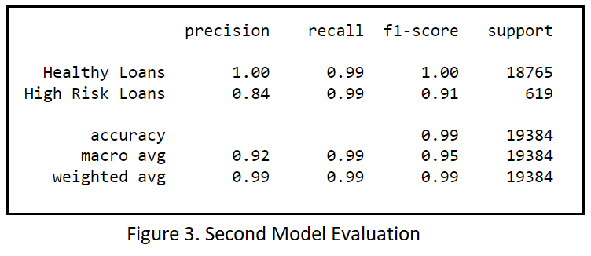

# credit-risk-classification
Here we use various techniques to train and evaluate a model based on loan risk. The dataset includes historical lending activity from a peer-to-peer lending services company. We want to build a model that can identify the creditworthiness of borrowers. 
## Data Analysis
As shown in Figure.1, the dataset includes 7 columns. We use the first six columns as our feature set and the last column, *loan_status* is our label. The loan_status has two values, 0 and 1. A value of 0 means that the loan is healthy while a value of 1 shows that the loan has a high risk of defaulting. Here we mainly need to identify unhealthy loans (loan_status: 1). In order to have an accurate model we need to have a balance of data, in our case, we need to have enough risky loans in our dataset. If we look at the value_counts of "loan_status" we will see the total number of high risk loans is about 3% of the whole data (Figure.1).

## Machine Learning Process
In the first part, data are splitted into training and testing datasets. Next, we fit a logistic regression model by using the training data and predict the testing data labels. Finally the model's performance is evaluated by using **accuracy score, confusion matrix and classification report**.

In the second part, we resample the date before training using the RandomOverSampler module. Then we do the same training and testing process to fit and evaluate the model.

## Results
#### Model 1 :
- balanced accuracy score :  0.9520479254722232
- Precision, and Recall (Figure.2)

### Model 2 :
- balanced accuracy scores :  0.9936781215845847
- Precision, and Recall (Figure.3)

## Summary

Our model should be able to classify *healthy loans* and *high risk loans*. Since the finding of risky loans are more important than the healthy ones, we are interested to the model with the higher accuracy on *high risk loans*.
In the first model(Logistic Regression without resampling), Healthy Loan('0') prediction is very accurate. For the High Risk Loan('1'), although the training data is not balanced (Healthy Loan:18765, Risky Loan:619) the model's accuracy is good enough to predict if a loan is high risk (precision:0.85, recall:0.91, f1-score:0.88). 

In the second model, we applied resampling before Logistic Regression. This model has a very good balanced accuracy score (0.9936781215845847). Compared to the first model, it has a better f1-score for the high risk loan which makes it more useful and reliable for our case. I recommend the second model, however I suggest  applying it to more balanced testing sets to come up with a more accurate evaluation.  

